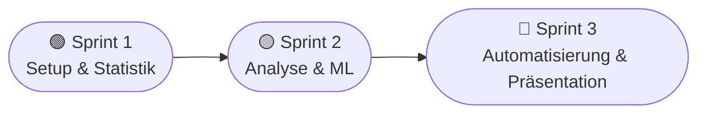

<div align="center">


<br/>


</div>

---

## 🎯 Über das Projekt

Data-Science- und KI-Projekt im Rahmen der Weiterbildung an der **Hochschule Hannover**
(Fakultät III – Medien, Information und Design). Umgesetzt wird ein vollständiger Workflow:
von der Speicherung in **PostgreSQL** über deskriptive Statistik, Einfluss-, Zusammenhangs-
und Hypothesenanalysen bis hin zu **Machine-Learning-Modellen** und einem automatisierten
Verarbeitungssystem.

> **❓ Fragestellung:** Welche Faktoren beeinflussen die Höhe der Schadenssumme sowie die
> Wahrscheinlichkeit eines Versicherungsbetrugs – und lassen sich diese vorhersagen?

<div align="center">

| 🧩 Aufgabe | 🎯 Zielvariable | 📌 Typ |
|---|---|---|
| **Regression** _(Pflicht)_ | `total_claim_amount` | Vorhersage der Gesamtschadenssumme |
| **Klassifikation** _(Bonus)_ | `fraud_reported` | Erkennung von Betrugsfällen |

</div>

---

## 👥 Team

| 👤 Mitglied | 📧 E-Mail |
|---|---|
| Oleg Fostii | olegfostij@gmail.com |
| Anton Duschak | anton.duschak@gmail.com |
| Bernard Turikumana | mutabazi105@gmail.com |

- 🏷️ **Gruppenname:** _<ABO_Team>_
- 📋 **Projektmanagement-Tool:** _<Jira-/https://github.com/fostij/InterGeeks-Agiles-Programmierprojekt.git>_

---

## 📊 Datensatz

**Auto Insurance Claims Data** (Kaggle, *buntyshah*) · **1000 Zeilen** · **40 Spalten**

<div align="center">


</div>

**🔍 Besonderheiten der Datenqualität:**
- ⚠️ Fehlende Werte als `?` codiert (`collision_type`, `property_damage`, `police_report_available`)
- 🗑️ Spalte `_c39` ist leer → wird verworfen
- ⚖️ Betrugsfälle unausgewogen (ca. 25 % `Y`) → relevant für die Klassifikation

> 📁 Die Datei `insurance_claims.csv` muss manuell unter `data/raw/` abgelegt werden (nicht im Repository enthalten).

---

## 🛠️ Tech-Stack

<div align="center">

| Bereich | Technologie |
|---|---|
| 🐍 Datenverarbeitung & Analyse | Python (pandas, NumPy, SciPy, statsmodels) |
| 🗄️ Datenspeicherung | PostgreSQL |
| 🤖 Machine Learning | scikit-learn |
| 📈 Visualisierung | matplotlib, seaborn |
| 🔄 Versionsverwaltung | Git & GitHub |
| 🌀 Vorgehen | Agile Entwicklung mit 3 Sprints |

</div>

---

## 📂 Projektstruktur

```
auto-insurance-claims/
├── 📁 config/         Konfiguration (DB-Zugangsdaten, nicht eingecheckt)
├── 📁 data/
│   ├── raw/          Rohdaten (insurance_claims.csv hier ablegen)
│   └── processed/    Aufbereitete Daten
├── 📁 sql/            SQL-Skripte (Schema, Laden, Transformation)
├── 📁 src/
│   ├── db/           Datenbankanbindung und Laden
│   ├── descriptive/  Deskriptive Statistik
│   ├── analysis/     Einfluss-, Zusammenhangsanalyse, Hypothesentests
│   ├── ml/           Machine-Learning-Modelle
│   └── automation/   Automatisiertes Verarbeitungssystem
├── 📁 notebooks/      Jupyter-Notebooks für Exploration
├── 📁 reports/        Ergebnisse und Grafiken
└── 📁 docs/           Dokumentation und Sprint-Planung
```

---

## 🚀 Einrichtung

<details open>
<summary><b>Schritt-für-Schritt-Anleitung</b></summary>

**1️⃣ Abhängigkeiten installieren**
```bash
pip install -r requirements.txt
```

**2️⃣ Datenbank-Zugangsdaten konfigurieren**
```bash
cp config/db_config.example.ini config/db_config.ini
# anschließend config/db_config.ini mit den eigenen Daten ausfüllen
```

**3️⃣ Datensatz ablegen**
> `insurance_claims.csv` nach `data/raw/` kopieren.

**4️⃣ Schema anlegen und Daten laden** (aus dem Projekt-Hauptverzeichnis)
```bash
psql -d insurance -f sql/01_schema.sql
psql -d insurance -f sql/02_load_raw.sql
psql -d insurance -f sql/03_transform_core.sql
```

Alternativ kann das Laden in das raw-Schema mit Python erfolgen:
```bash
python -m src.db.load_data
```

</details>

---

## 🌀 Sprint-Planung



| Sprint | Inhalt |
|:--:|---|
| **1️⃣** | Setup, Datensatzauswahl, Datenbankaufbau, deskriptive Statistik |
| **2️⃣** | Einfluss- und Zusammenhangsanalyse, Hypothesentests, Machine Learning |
| **3️⃣** | Automatisierung, optionale Weboberfläche, Präsentation |

> 📄 Details siehe [`docs/sprint1_backlog.md`](docs/sprint1_backlog.md)

---

## 📅 Wichtige Termine

| 📌 Abgabe | ⏰ Frist |
|---|:--:|
| Gruppenname, Mitglieder, PM-Tool-Link | **09.06.2026, 10:00** |
| Präsentation (erste Version) | **24.06.2026, 12:00** |
| Finale Abgabe (Code, DB, Doku, GitHub) | **03.07.2026, 11:59** |

📩 Alle Abgaben an: `mohammad.al-nasouh@hs-hannover.de`

---

## 🔒 Datenschutzhinweis

> Es werden **ausschließlich Testdaten** verwendet. Es findet **keine Verarbeitung realer
> Kundendaten** statt. Datenschutzrechtliche Anforderungen werden bei der Entwicklung des
> automatisierten Systems grundsätzlich berücksichtigt.

<div align="center">


<sub>⭐ Hochschule Hannover · Fakultät III – Medien, Information und Design · 2026</sub>

</div>
